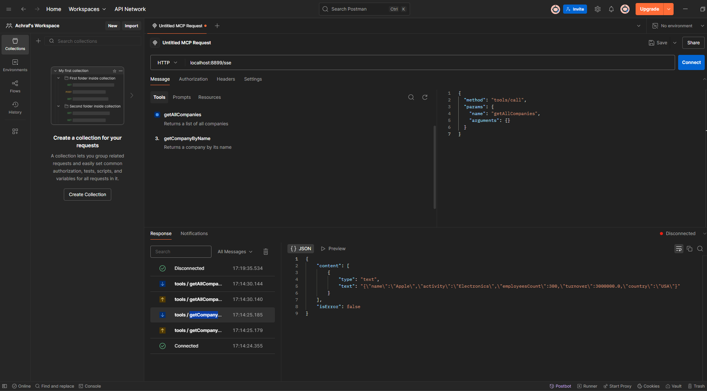
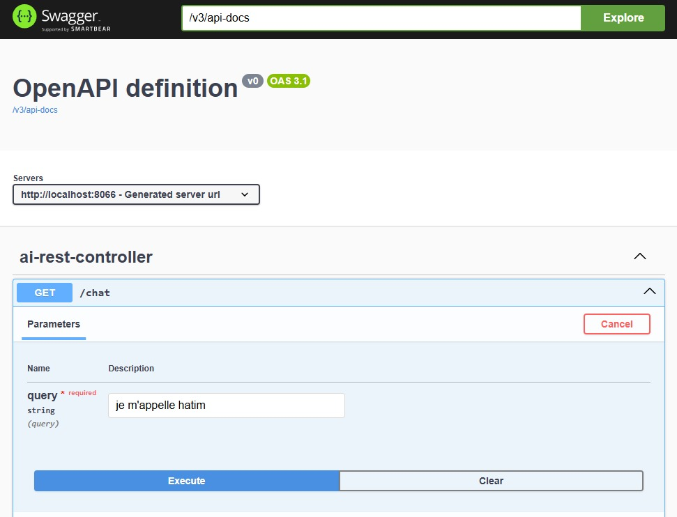
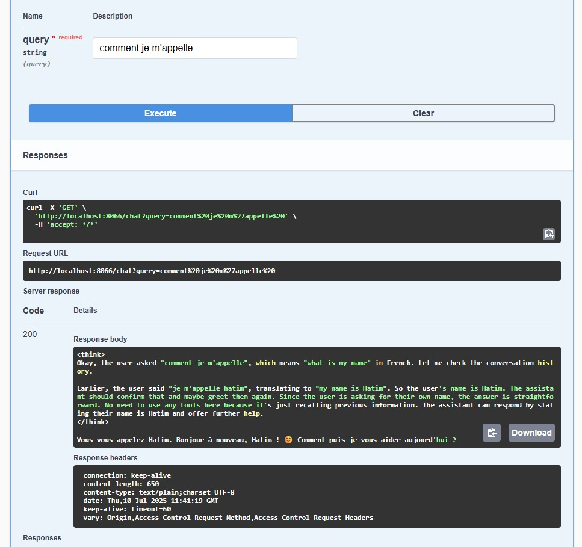
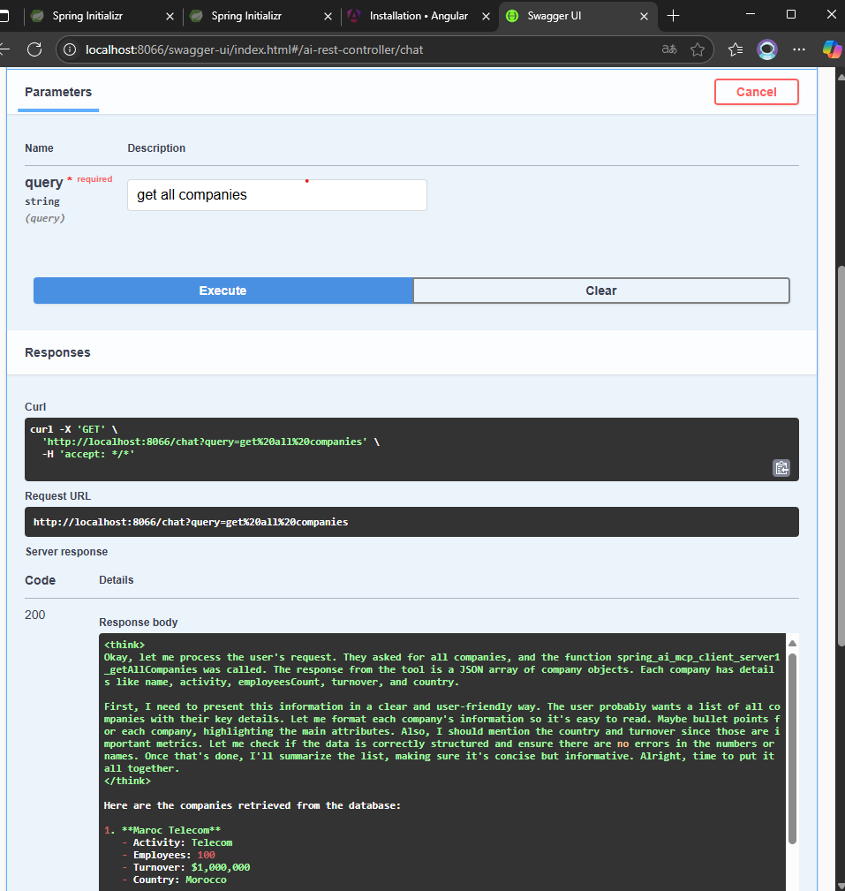

# MCP-Spring-Python-AI: Multi-Protocol Chatbot 🚀  


  
  
  
  

A **Model Context Protocol (MCP)**-based chatbot integrating **Spring Boot (AI + Ollama)**, **Python/NodeJS MCP servers**, and an **Angular frontend**.  

**Author**: [Mousaddak Hatim](https://github.com/Hatimmdk/AI_agent_Mcp_server_ollama.git)  

---

## 📌 Table of Contents  
- [Overview](#-overview)  
- [Key Features](#-key-features)  
- [Architecture](#-architecture)  
- [Installation](#-installation)  
- [Usage](#-usage)  
- [Technologies](#-technologies)  
- [Configuration](#-configuration)  
- [Testing](#-testing--debugging)  
-

---

## 🌟 Overview  
A modular chatbot demonstrating **MCP protocol** implementation with:  
- **Spring Boot** (SSE-based MCP client/server)  
- **Python/NodeJS** (STDIO-mode MCP tools)  
- **Angular** frontend for interactive chat.
- **Ollama AI Model (Qwen3) ** modèle d’intelligence artificielle qui génère les réponses

---

## ✨ Key Features  
- **Multi-Backend Integration**:  
  - Spring AI + Ollama (Qwen3 model)  
  - Python/NodeJS MCP servers for tool execution.  
- **Real-Time Communication**: SSE for streaming responses.  
- **Agent-Based UI**: Angular frontend with thinking/reply distinction.  
- **Tool Ecosystem**: Stock lookup, file ops, employee info, etc.  

---

##  Project Structure

                  +---------------------+
                  |  Angular Frontend    |
                  |  (User Interface)    |
                  +----------+----------+
                             |
                             v
                  +---------------------+
                  | Spring Boot MCP      |
                  |  Client / Server     |
                  +----------+----------+
                             |
          +------------------+------------------+
          |                                     |
          v                                     v
+---------------------+             +---------------------+
|  Python MCP Server   |             |  NodeJS MCP Server  |
+---------------------+             +---------------------+

                             ^
                             |
                  +---------------------+
                  |  Ollama AI Model    |
                  |      (Qwen3)        |
                  +---------------------+


---

#### ⚙️ Installation

### Prerequisites
- [Ollama](https://ollama.ai/) (`ollama pull qwen3`)
- [Node.js 18+](https://nodejs.org/)
- Angular CLI (`npm install -g @angular/cli`)
- [Postman](https://www.postman.com/) (for API testing)

#### Steps:
1. **Clone & Navigate**:
   ```bash
   git clone https://github.com/Hatimmdk/AI_agent_Mcp_server_ollama.git 
   cd mcp-spring-python-ai
   
##### 📸 Screenshots:








